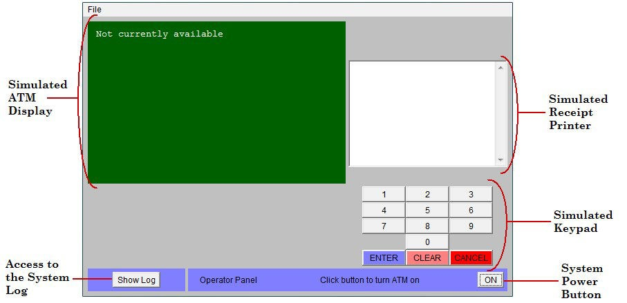

**SENG 438 - Software Testing, Reliability, and Quality**
>   **Assignment \#1**
>   **Introduction to Testing and Defect (Bug) Tracking**
>   Instructors: 
>   -   Dr. Behrouz Far (far@ucalgary.ca)
>   -   Dr. Kangsoo Kim (kangsoo.kim@ucalgary.ca)
>   Department of Electrical and Software Engineering
>   University of Calgary

Due Date: Check D2L for the submission deadline.

# 1 Introduction

This lab is designed to provide students with a comprehensive understanding of software testing. The lab is divided into four main sections:
-   Familiarization with the system under test (SUT) and the defect tracking system
-   Exploratory (manual non-scripted) testing
-   Manual scripted testing
-   Regression testing (re-testing a system after it has been changed)

In the familiarization stage, students will explore the software system to be tested (System Under Test, or SUT), as well as a typical defect tracking
system. During the exploratory testing phase, students will be free to test the system in any manner that they choose (and are able). Once students reach
the manual scripted testing phase, they will be required to use a predefined test suite to test the SUT. Finally, students will perform some simple regression testing on an updated version of the system (corrected by imaginary developers in response to a list of defect reports), and record differing system behavior in the defect tracking system appropriately.

# Objectives
This lab is designed to provide students with a basic understanding of software testing concepts. By participating in this lab, students will gain:

-   Practical experience in testing a software system
-  Knowledge of the differences between exploratory, manual scripted, and regression testing
-   Familiarity with industrial defect tracking systems, processes, and practices.

This lab aims to provide students with a foundational understanding of software testing so that they can apply these concepts in real-world scenarios.

# Pair Testing
In this lab, two students in each group will work together in "pair testing." This technique is a software development method in which two team members work at one keyboard to test the software application. One person will conduct the testing while the other reviews and analyzes the results. This technique can be used between a tester and developer, business analyst, or between two testers who take turns at the keyboard. This approach allows for more efficient and effective testing, as well as an opportunity for team members to learn from each other.

# Group Work

In this lab, each group will consist of 4 members. Two members will work together in a pair testing method to complete the lab report. After the pair testing, both pairs will combine their reports and submit one final lab report.

# Submission Guidelines
All lab reports in this course should be submitted on GitHub. It is important to follow the suggested format when submitting your lab report on D2L and on GitHub.

## D2L Submission
-   Please make sure to include your group number
-   Provide the link to your GitHub repository
-   Include the full name and student ID of all group members

## GitHub Submission
-   Include your group number
-   Include the first name of all group members
-   It is important to note that personal information such as student ID should not be included in the GitHub submission.

-   The main lab report must be submitted in the .md (Markdown File Format) only. Submitting in any other format will result in a loss of marks.
-   You are not allowed to submit Microsoft Word of PDF or any other file format for your main reports.
-   The attachments for example bug list and screen shots can be in any other file format

-   One member of the group should be responsible for submitting the link to the GitHub repository on D2L. The due date for this assignment can be found on D2L. Make sure to submit your lab report and all necessary files before the deadline.

It is important to follow these guidelines to ensure a smooth submission process and to avoid any issues or delays.

# Issue Tracking Systems
The only tool required for this lab is an issue tracking system. In this lab, we will be using Atlassian Jira (https://www.atlassian.com/software/jira) or Azure DevOps (https://azure.com/devops) as our defect tracking system. These systems are widely used in the software industry for managing and tracking bugs and issues. They provide features such as the ability to prioritize and assign defects to developers, advanced search capabilities, and integration with email notifications. By using these systems, students will gain hands-on experience with industry-standard tools for defect tracking.

To familiarize yourself with these tools, you can use the following source or any other source of your choice:
- [Reporting bugs in Jira Software](https://marker.io/blog/jira-bug-tracking#reporting-bugs-in-jira-software)
- Azure DevOps:
    - [Create Organization](https://aex.dev.azure.com/me?mkt=en-GB)
    - [Change basic project to (agile, scrum or CMMI)](https://learn.microsoft.com/en-us/azure/devops/organizations/settings/work/change-process-basic-to-agile?view=azure-devops)
    - [How to report bug as a work item I](https://www.azuredevopsguide.com/creating-a-bug-in-azure-devops/)
    - [How to report bug as a work item I](https://learn.microsoft.com/en-us/azure/devops/boards/backlogs/manage-bugs?view=azure-devops#bug-work-item-type)
    

# Lab Materials
In addition to the lab document, which is to be submitted in a markdown file format, each lab in this course will require additional materials. These materials, known as lab artifacts, may include items such as the software system under test (SUT), source code, and other relevant files. It is important to submit all required lab artifacts as specified in each lab's instructions to ensure proper evaluation of your lab work.

# System Under Test

The system under test for this lab is an ATM simulation system [1]. To get started with this system, download the *lab_artifacts.zip* file under Assignment 1. There are two versions of the ATM system inside that zip file which represent two consecutive releases of the software with bugs and bug fixes (details in the next sections):

-   ATM System - Lab 1 Version 1.0
-   ATM System - Lab 1 Version 1.1

1.  **Purpose of the System**

This system was originally developed in an American college (called Gordon College) in order to demonstrate an entire iteration of an object-oriented software development methodology. The entire project is available open-source online, see reference [1] for the URL. The purpose of the system is to allow the user to deposit, withdraw, query and transfer funds to/from his/her hypothetical
bank account(s).

2.  **Usage of the System**

    To use the ATM simulation system, run JAR file *ATM System – Lab 1 Version 1.0.jar* which is inside *Assignment 1 - artifacts.zip*. The system should begin execution with the GUI as shown in Appendix A.

    There are two valid hard-coded card numbers and PINs:
    -  Card Number: 1 PIN: 42 Available Accounts: Checking and Savings

    -  Card Number: 2 PIN: 1234 Available Accounts: Checking and Money Market Note:
    
    Both of these cards access the same checking account.

    The initial balances are: Checking: \$100 Savings: \$1,000 Money Market: \$5,000

# Instructions

This section outlines the steps required to complete the lab. 

## Familiarization with the ATM System

1. Run the JAR file ATM System - Lab 1 Version 1.0.jar to display the GUI 

2. Turn on the system using the “On” button.

3. Enter the number of \$20 bills that the system is assumed to start with, noting that this is the number of bills, not the total value of the bills. For example, entering a value of 10 indicates that the ATM is starting with \$200 (10 twenty-dollar bills). Any number greater than 0 will suffice for now.

4. Click on the “Click to insert card” button which is now displayed on the main interface below the simulated ATM display.

5. The screen will change to a prompt for the user to input the card number (since there is no actual physical card reader). Enter 1 for the card number and press Enter. Upon returning to the main screen, the display will now request the PIN to be entered.

6. Type 42 using the simulated keypad and press Enter. The display will now prompt the user to perform one of four transactions: withdraw, deposit, transfer, or balance inquiry

7. Press 2 on the simulated keypad to perform a deposit. The display will now prompt the user to indicate which account they would like to deposit to: checking, savings, or the money market account.

8. Press 2 on the simulated keypad to deposit to the savings account. The display will now prompt the user to enter the deposit amount.

9. Enter a positive value and press Enter. A button that simulates inserting the deposit envelope will appear.

10. Click the button to simulate inserting the envelope. The display will prompt the user to perform another transaction or not.

11. Press 2 on the simulated keypad to indicate that you do not wish to perform another transaction. The main window will show a button that simulates the card being ejected.

12. Press the System Power Button again to turn off the ATM system.

## Writing Effective Bug Reports

When creating bug reports, it's important to include certain key elements that product support teams will expect and require. **When submitting your bug reports, make sure to include**:

-   The function being tested (e.g. login)
-   The initial state of the system (e.g. the system is on and idle)
-   Detailed steps to reproduce the defect/bug (e.g. insert a card, enter the correct card number and PIN)
-   The expected outcome (e.g. the system should successfully accept the customer and display the banking menu)
-   The actual outcome (e.g. the system crashes or displays an error message)

## Exploratory (Manual Non-scripted) Testing

1. In order to perform any testing, the requirements must first be known. Read over the requirements for the ATM simulation system as outlined in Appendix B before continuing with the rest of this section.

2. Before beginning testing, try to come up with a high-level exploratory test plan for how you intend to test the system. Record key details of this plan, as it will be required in the lab report. This plan could include but is not limited to, information such as: functions being targeted, the approach to be taken (test most functions a little bit, or test a few functions extensively, etc.), and how you plan to come up with test cases (test most common paths, or exceptional paths, etc.).
Keep in mind that this does not need to necessarily be the best plan, as long as it is justifiable.

1. Reporting defects: Carry out your devised exploratory test plan for roughly half an hour. Each pair of students needs to perform exploratory testing and record defects. While performing the tests, if any of the actual results differ from the expected results, report that as a defect. Record defects as they are found before forgetting the defect and its detailed conditions. At the end, two pairs of each group will review all defects and report them in the bug tracking tool.

## Manual Scripted Testing
 This section is to be performed as a group. One student can ‘drive’ the testing (operate the computer executing the system under test), while the other student keeps track of which tests have been performed, reports any defects found, and determines what order to execute tests in. Keep track of what order the tests are executed in, as it will be useful information later on. Note that it does not matter which student reports the defects, as it is a group effort.

1.  In Appendix C, a basic test suite has been provided for this SUT. Execute each of the test cases at least once, verifying that the actual results match the expected results for each case. Report any defects found. In order to differentiate between defects found during this stage and the previous stage, in the summary field type “MFT:“ (Manual Functional Testing) before the summary of the defect. Do not report defects which have already been found by your group during the exploratory testing phase, however you may wish to take note of which defects are found using both testing methods as it may be relevant in your report.

2.  Upon completion of testing, review all defect reports created. To do this,perform a search (in backlog, you may need to use the your project innavigation bar then “Issues” and then “Search” feature for this) for defectscontaining “MFT:” in the summary field. This will produce a list of thenewly added defect reports. The student who was previously executing thetests should now be the main participant in reviewing the defect reports.

## Regression Testing (Verification of Defect Fixes)

This section is to be performed as a group. The defects reported in the twoprevious stages of testing can be divided among the 
group members and can beretested individually.

1.  Download the updated version (version 1.1) of the ATM simulation system from blackboard. This version of the system has been partially fixed by imaginary developers based on the defect reports previously existing.

2.  Add an additional version (1.1) for your product in your bug tracking system, by simply using the same procedure for reporting the issues in version section writhe but version 1.1 (the issues for previous version should be marked as 1.0).

3.  Perform a search in your bug tracking tool for all defects reported by your group for version 1.0 of the ATM system product.

4.  Retest each of these defects to determine which have been fixed and which have not. Since we do not know which defects have been fixed exactly, assume that all defects have had an attempt to fix them. Update the defect status to Resolved (Fixed) by opening that defect for editing, and changing its status appropriately. If the defect has actually been fixed in the ATM system version 1.1, change the status once again to RSOLVED. If the defect has not actually been fixed in the ATM system version 1.1, change the status to IN-PROGRESS and write a comment stating “Defect still exists in version 1.1”.

5.  Execute steps 4 and 5 (Manual Scripted Testing) once again, looking only for new defects that have been created. If a defect is found which had previously been reported, do not report it again. When reporting these defects, ensure that version 1.1 is selected.

# Summary
Within your group, you should now each be familiar with the main features of a bug tracking system, and have a general understanding of how to use it to effectively report and track defects. You have also progressed through a short iteration of exploratory testing, two iterations of manual functional testing and an iteration of regression testing.

# Deliverables and Grading

For this assignment, you need to submit one Excel/PDF/Markdown file and the lab report and demo your findings in the lab.

## Demo (25%)
The demo session for this lab serves several purposes: 
- preparing students for technical presentations, 
- providing an early assessment of work to improve quality, and 
- ensuring equal participation among team members. 

All members must attend the lab and demonstrate examples of tests run and bugs found for each testing phase (exploratory, scripted, and regression). 
Each team member should show at least one passing and one failing test, as well as the corresponding Backlog entry. 

Failure to attend or demonstrate as required may result in loss of marks for the entire assignment. 

Note that opportunities for improvement will continue until the deadline.

## Defect Reports (35%)

Grading for students will be based on the quality of their defect reports, which must be submitted to their GitHub repository. They should use the designated bug tracking system to create a detailed report of any bugs found, in either PDF, Excel, or Markdown format. If the tool does not produce a report, one must be manually created.

The grading criteria (rubric) for defect reports are as follows.

| **Defect Reports**                                                                                                                                                                                                                      |     |
| --------------------------------------------------------------------------------------------------------------------------------------------------------------------------------------------------------------------------------------- | --- |
| Correctness: Do the defect reports contain the detailed defect information? Does the report contain all the defects in the same level of detail? Does it contain the input, the expected output, and the faulty output for each defect? | 15% |
| Clarity and adherence to defect reporting guidelines: Is it obvious where to start (what state to bring the program to) to replicate the defect? Is it obvious what you would type? Is it obvious what files to use (if any)?           | 15% |
| Number of defects found: Note that not all defects need to be found. But if it appears that not enough effort was made in finding defects, marks may be deducted.                                                                       | 5%  |

## Lab Report (40%)

To be consistent, please use the template markdown file “seng438-1-team_number.md” provided online. Change the team number to your team number. If desired, feel free to rename the sections, as long as the headings are still descriptive and accurate.

| **Lab Report**                                                                                                                                                                      |     |
| ----------------------------------------------------------------------------------------------------------------------------------------------------------------------------------- | --- |
| An introduction section including what you knew about exploratory and manual functional testing before this lab                                                                     | 5%  |
| A high-level description of the exploratory testing plan                                                                                                                            | 5%  |
| A comparison of exploratory and manual functional testing (based on the provided test suite) from several perspectives (e.g., benefits, tradeoffs, effectiveness, efficiency, etc.) | 10% |
| Notes and discussion of the peer reviews of defect reports created by each pair in a group.                                                                                         | 5%  |

| Any lessons learned from your teamwork on this lab?                                                                                                                      | 5%  |
| ------------------------------------------------------------------------------------------------------------------------------------------------------------------------ | --- |
| Any difficulties encountered, challenges overcome, and lessons learned from performing the lab                                                                           | 5%  |
| Comments/feedback on the lab and lab document itself. (Did you find it a useful practice? Was it easy to follow?) Please try to keep comments and feedback constructive. | 5%  |

# Acknowledgements

This lab is part of a software-testing laboratory course available under a Creative Commons license.

Some part of this document has been developed in the former SoftQual lab of University of Calgary for teaching SENG 437.

# References

-  [1] R. C. Bjork, "Example ATM Simulation System," Internet: http://www.math-cs.gordon.edu/courses/cps211/ATMExample/ [Jan, 2017]
-  [2] J. B. Cem Kaner, Bret Pettichord, "Chapter 4 - Bug Advocacy," in Lessons Learned in Software Testing, New York: John Wiley & Sons Inc., 2002.
-  [3] C. Kaner, "Assignment - Replicate and Edit Bugs," 2008.

# Appendix
## Appendix A: GUI

## Appendix B: High Level Requirements

The software to be designed will control a simulated Automated Teller Machine
(ATM) having a magnetic stripe reader for reading an ATM card, a customer
console (keyboard and display) for interaction with the customer, a slot for
depositing envelopes, a dispenser for cash (in multiples of \$20), a printer for
printing customer receipts, and a key-operated switch to allow an operator to
start or stop the machine. The ATM will communicate with the bank's computer
over an appropriate communication link. (The software on the latter is not part
of the requirements for this problem.)

The ATM will service one customer at a time. A customer will be required to
insert an ATM card and enter a Personal Identification Number (PIN) - both of
which will be sent to the bank for validation as part of each transaction. The
customer will then be able to perform one or more transactions. The card will be
retained in the machine until the customer indicates that he/she desires no
further transactions, at which point it will be returned - except as noted
below.

>   The ATM must be able to provide the following services to the customer:

-   A customer must be able to make a cash withdrawal from any suitable account
    linked to the card, in multiples of

    \$20.00. Approval must be obtained from the bank before cash is dispensed.

    -   A customer must be able to make a deposit to any account linked to the
        card, consisting of cash and/or checks in an envelope. The customer will
        enter the amount of the deposit into the ATM, subject to manual
        verification when the envelope is removed from the machine by an
        operator. Approval must be obtained from the bank before physically
        accepting the envelope.

        -   A customer must be able to make a transfer of money between any two
            accounts linked to the card.

        -   A customer must be able to make a balance inquiry of any account
            linked to the card.

        -   A customer must be able to abort a transaction in progress by
            pressing the Cancel key instead of responding to a request from the
            machine.

The ATM will communicate each transaction to the bank and obtain verification
that it was allowed by the bank. Ordinarily, a transaction will be considered
complete by the bank once it has been approved. In the case of a deposit, a
second message will be sent to the bank indicating that the customer has
deposited the envelope. (If the customer fails to deposit the envelope within
the timeout period, or presses cancel instead, no second message will be sent to
the bank and the deposit will not be credited to the customer.)

If the bank determines that the customer's PIN is invalid, the customer will be
required to re-enter the PIN before a transaction can proceed. If the customer
is unable to successfully enter the PIN after three tries, the card will be
permanently retained by the machine, and the customer will have to contact the
bank to get it back.

If a transaction fails for any reason other than an invalid PIN, the ATM will
display an explanation of the problem, and will then ask the customer whether
he/she wants to do another transaction.

The ATM will provide the customer with a printed receipt for each successful
transaction, showing the date, time, machine location, type of transaction,
account(s), amount, and ending and available balance(s) of the affected account
("to" account for transfers).

The ATM will have a key-operated switch that will allow an operator to start and
stop the servicing of customers. After turning the switch to the "on" position,
the operator will be required to verify and enter the total cash on hand. The
machine can only be turned off when it is not servicing a customer. When the
switch is moved to the "off" position, the machine will shut down, so that the
operator may remove deposit envelopes and reload the machine with cash, blank
receipts, etc.

The ATM will also maintain an internal log of transactions to facilitate
resolving ambiguities arising from a hardware failure in the middle of a
transaction. Entries will be made in the log when the ATM is started up and shut
down, for each message sent to the Bank (along with the response back, if one is
expected), for the dispensing of cash, and for the receiving of an envelope. Log
entries may contain card numbers and dollar amounts, but for security will
*never* contain a PIN.

## Appendix C: SUT Use Cases

| **Test Case \#** | **Use Case**        | **Function Being Tested**                                        | **Initial System State**                                    | **Input**                                             | **Expected Output**                                                                      |
| ---------------- | ------------------- | ---------------------------------------------------------------- | ----------------------------------------------------------- | ----------------------------------------------------- | ---------------------------------------------------------------------------------------- |
| 1                | **System Startup**  | System is started when the switch is turned "on"                 | System is off                                               | Activate the "on" switch                              | System requests initial cash amount                                                      |
| 2                | **System Startup**  | System accepts initial cash amount                               | System is requesting cash amount                            | Enter a legitimate amount                             | System is on                                                                             |
| 3                | **System Startup**  | Connection to the bank is established                            | System has just been turned on                              | Perform a legitimate inquiry transaction              | System output should demonstrate that a connection has been established to the Bank      |
| 4                | **System Shutdown** | System is shut down when the switch is turned “off"              | System is on and not servicing a customer                   | Activate the "off" switch                             | System is off                                                                            |
| 5                | **Session**         | System reads a customer's ATM card                               | System is on and not servicing a customer                   | Insert a readable card                                | Card is accepted; System asks for entry of PIN                                           |
| 6                | **Session**         | System rejects an unreadable card                                | System is on and not servicing a customer                   | Insert an unreadable card                             | Card is ejected; System displays an error screen; System is ready to start a new session |
| 7                | **Session**         | System accepts customer's PIN                                    | System is asking for entry of PIN                           | Enter a PIN                                           | System displays a menu of transaction types                                              |
| 8                | **Session**         | System allows customer to perform a transaction                  | System is displaying menu of transaction types              | Perform a transaction                                 | System asks whether customer wants another transaction                                   |
| 9                | **Session**         | System allows multiple transactions in one session               | System is asking whether customer wants another transaction | Answer yes                                            | System displays a menu of transaction types                                              |
| 10               | **Session**         | Session ends when customer chooses not to do another transaction | System is asking whether customer wants another transaction | Answer no                                             | System ejects card and is ready to start a new session                                   |
| 11               | **Transaction**     | System handles an invalid PIN properly                           | A readable card has been entered                            | Enter an incorrect PIN and then attempt a transaction | The Invalid PIN exception is performed                                                   |

| 12  | **Withdrawal** | System asks customer to choose an account to withdraw from                                             | Menu of transaction types is being displayed                                                                                      | Choose Withdrawal transaction                                                                    | System displays a menu of account types                                                                                                                                                                                |
| --- | -------------- | ------------------------------------------------------------------------------------------------------ | --------------------------------------------------------------------------------------------------------------------------------- | ------------------------------------------------------------------------------------------------ | ---------------------------------------------------------------------------------------------------------------------------------------------------------------------------------------------------------------------- |
| 13  | **Withdrawal** | System asks customer to choose a dollar amount to withdraw                                             | Menu of account types is being displayed                                                                                          | Choose checking account                                                                          | System displays a menu of possible withdrawal amounts                                                                                                                                                                  |
| 14  | **Withdrawal** | System performs a legitimate withdrawal transaction properly                                           | System is displaying the menu of withdrawal amounts                                                                               | Choose an amount that the system currently has and which is not greater than the account balance | System dispenses this amount of cash; System prints a correct receipt showing amount and correct updated balance; System records transaction correctly in the log (showing both message to the bank and approval back) |
| 15  | **Withdrawal** | System verifies that it has sufficient cash on hand to fulfill the request                             | System has been started up with less than the maximum withdrawal amount in cash on hand; System is requesting a withdrawal amount | Choose an amount greater than what the system currently has                                      | System displays an appropriate message and asks customer to choose a different amount                                                                                                                                  |
| 16  | **Withdrawal** | System verifies that customer's balance is sufficient to fulfill the request                           | System is requesting a withdrawal amount                                                                                          | Choose an amount that the system currently has but which is greater than the account balance     | System displays an appropriate message and offers customer the option of choosing to do another transaction or not.                                                                                                    |
| 17  | **Withdrawal** | A withdrawal transaction can be cancelled by the customer any time prior to choosing the dollar amount | System is displaying menu of account types                                                                                        | Press "Cancel" key                                                                               | System displays an appropriate message and offers customer the option of choosing to do another transaction or not.                                                                                                    |
| 18  | **Withdrawal** | A withdrawal transaction can be cancelled by the customer any time prior to choosing the dollar amount | System is displaying menu of dollar amounts                                                                                       | Press "Cancel" key                                                                               | System displays an appropriate message and offers customer the option of choosing to do another transaction or not.                                                                                                    |
| 19  | **Deposit**    | System asks customer to choose an account to deposit to                                                | Menu of transaction types is being displayed                                                                                      | Choose Deposit transaction                                                                       | System displays a menu of account types                                                                                                                                                                                |
| 20  | **Deposit**    | System asks customer to enter a dollar amount to deposit                                               | Menu of account types is being displayed                                                                                          | Choose checking account                                                                          | System displays a request for the customer to type a dollar amount                                                                                                                                                     |

| 21  | **Deposit**  | System asks customer to insert an envelope                                                     | System is displaying a request for the customer to type a dollar amount | Enter a legitimate dollar amount | System requests that customer insert an envelope                                                                                                                                                                                  |
| --- | ------------ | ---------------------------------------------------------------------------------------------- | ----------------------------------------------------------------------- | -------------------------------- | --------------------------------------------------------------------------------------------------------------------------------------------------------------------------------------------------------------------------------- |
| 22  | **Deposit**  | System performs a legitimate deposit transaction properly                                      | System is requesting that customer insert an envelope                   | Insert an envelope               | System accepts envelope; System prints a correct receipt showing amount and correct updated balance; System records transaction correctly in the log (showing message to the bank, approval back, and acceptance of the envelope) |
| 23  | **Deposit**  | A deposit transaction can be cancelled by the customer any time prior to inserting an envelope | System is displaying menu of account types                              | Press "Cancel" key               | System displays an appropriate message and offers customer the option of choosing to do another transaction or not.                                                                                                               |
| 24  | **Deposit**  | A deposit transaction can be cancelled by the customer any time prior to inserting an envelope | System is requesting customer to enter a dollar amount                  | Press "Cancel" key               | System displays an appropriate message and offers customer the option of choosing to do another transaction or not.                                                                                                               |
| 25  | **Deposit**  | A deposit transaction can be cancelled by the customer any time prior to inserting an envelope | System is requesting customer to insert an envelope                     | Press "Cancel" key               | System displays an appropriate message and offers customer the option of choosing to do another transaction or not.                                                                                                               |
| 26  | **Transfer** | System asks customer to choose an account to transfer from                                     | Menu of transaction types is being displayed                            | Choose Transfer transaction      | System displays a menu of account types specifying transfer from                                                                                                                                                                  |
| 27  | **Transfer** | System asks customer to choose an account to transfer to                                       | Menu of account types to transfer from is being displayed               | Choose checking account          | System displays a menu of account types specifying transfer to                                                                                                                                                                    |
| 28  | **Transfer** | System asks customer to enter a dollar amount to transfer                                      | Menu of account types to transfer to is being displayed                 | Choose savings account           | System displays a request for the customer to type a dollar amount                                                                                                                                                                |
| 29  | **Transfer** | System performs a legitimate transfer transaction properly                                     | System is displaying a request for the customer to type a dollar amount | Enter a legitimate dollar amount | System prints a correct receipt showing amount and correct updated balance; System records transaction correctly in the log (showing both message to the bank and approval back)                                                  |
| 30  | **Transfer** | A transfer transaction                                                                         | System is displaying                                                    | Press "Cancel"                   | System displays an appropriate                                                                                                                                                                                                    |
|     |              | can be cancelled by the                                                                        | menu of account types                                                   | key                              | message and offers customer the                                                                                                                                                                                                   |
|     |              | customer any time                                                                              | specifying transfer                                                     |                                  | option of choosing to do another                                                                                                                                                                                                  |
|     |              | prior to entering dollar                                                                       | from                                                                    |                                  | transaction or not.                                                                                                                                                                                                               |
|     |              | amount                                                                                         |                                                                         |                                  |                                                                                                                                                                                                                                   |

| 31  | **Transfer**              | A transfer transaction can be cancelled by the customer any time prior to entering dollar amount | System is displaying menu of account types specifying transfer to | Press "Cancel" key                                                                        | System displays an appropriate message and offers customer the option of choosing to do another transaction or not.                                           |
| --- | ------------------------- | ------------------------------------------------------------------------------------------------ | ----------------------------------------------------------------- | ----------------------------------------------------------------------------------------- | ------------------------------------------------------------------------------------------------------------------------------------------------------------- |
| 32  | **Transfer**              | A transfer transaction can be cancelled by the customer any time prior to entering dollar amount | System is requesting customer to enter a dollar amount            | Press "Cancel" key                                                                        | System displays an appropriate message and offers customer the option of choosing to do another transaction or not.                                           |
| 33  | **Inquiry**               | System asks customer to choose an account to inquire about                                       | Menu of transaction types is being displayed                      | Choose Inquiry transaction                                                                | System displays a menu of account types                                                                                                                       |
| 34  | **Inquiry**               | System performs a legitimate inquiry transaction properly                                        | System is displaying menu of account types                        | Choose checking account                                                                   | System prints a correct receipt showing correct balance; System records transaction correctly in the log (showing both message to the bank and approval back) |
| 35  | **Inquiry**               | An inquiry transaction can be cancelled by the customer any time prior to choosing an account    | System is displaying menu of account types                        | Press "Cancel" key                                                                        | System displays an appropriate message and offers customer the option of choosing to do another transaction or not.                                           |
| 36  | **Invalid PIN Extension** | Customer is asked to reenter PIN                                                                 | System is asking for entry of PIN                                 | Enter an incorrect PIN; Attempt an inquiry transaction on the customer's checking account | Customer is asked to re-enter PIN                                                                                                                             |
| 37  | **Invalid PIN Extension** | Correct re-entry of PIN is accepted                                                              | Request to re-enter PIN is being displayed                        | Enter correct PIN                                                                         | Original transaction completes successfully                                                                                                                   |
| 38  | **Invalid PIN Extension** | Incorrect re-entry of PIN is not accepted                                                        | Request to re-enter PIN is being displayed                        | Enter incorrect PIN                                                                       | An appropriate message is displayed and re-entry of the PIN is again requested                                                                                |
| 39  | **Invalid PIN Extension** | Correct re-entry of PIN on the second try is accepted                                            | Request to re-enter PIN is being displayed                        | Enter incorrect PIN the first time, then correct PIN the second time                      | Original transaction completes successfully                                                                                                                   |
| 40  | **Invalid PIN Extension** | Correct re-entry of PIN on the third try is accepted                                             | Request to re-enter PIN is being displayed                        | Enter incorrect PIN the first time and second times, then correct PIN the third time      | Original transaction completes successfully                                                                                                                   |
