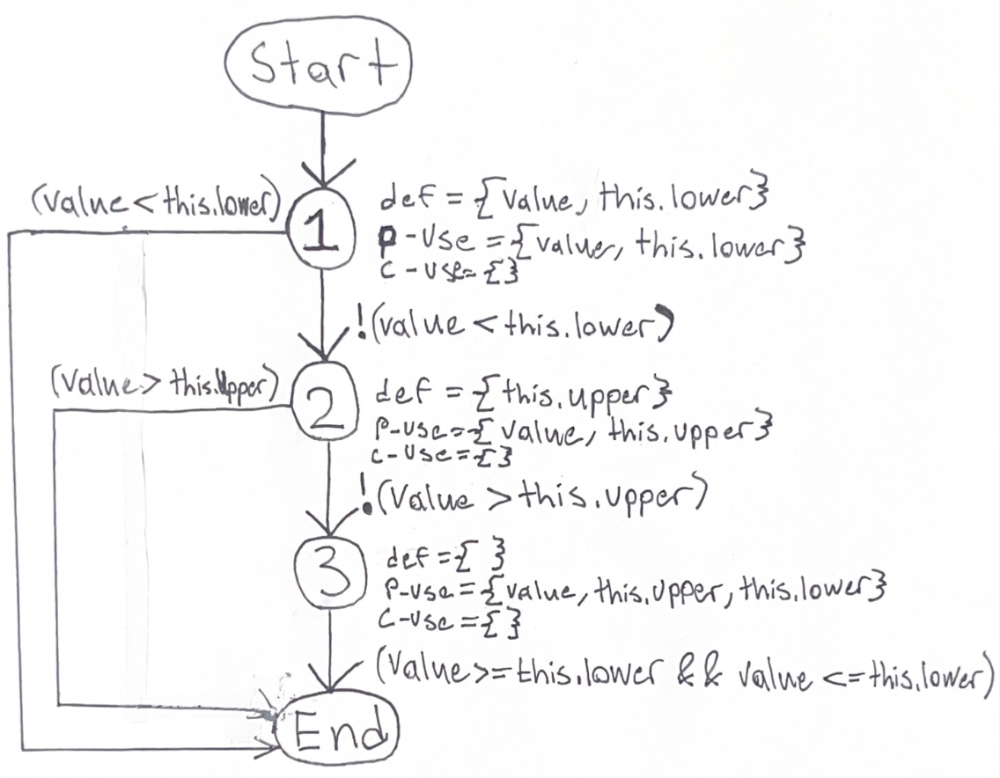
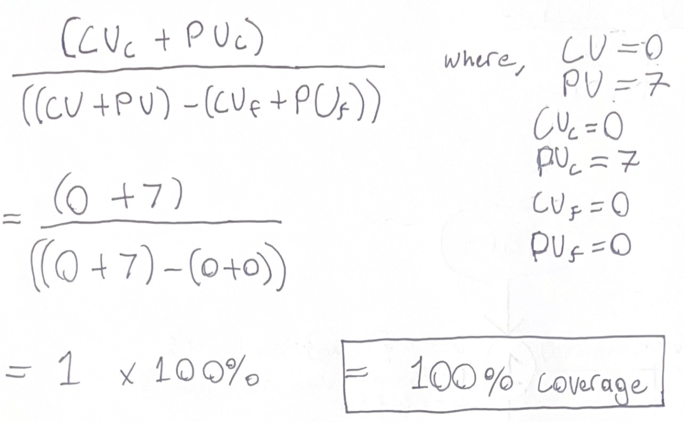

**SENG 438 - Software Testing, Reliability, and Quality**

**Lab. Report #3 – Code Coverage, Adequacy Criteria and Test Case Correlation**

| Group: Group Number 17     |
|-----------------|
| Student 1 Kolby Lalonde                |   
| Student 2 Sadman Shahriar              |   
| Student 3 Nolan Parmar              |   
| Student 4 Siddharth Menon           |   

(Note that some labs require individual reports while others require one report
for each group. Please see each lab document for details.)

# 1 Introduction

In this lab we where tasked with determining the adequacy of a white-box test suite based on its coverage of the code. We have been given the task of once again testin the Range and DataUtilies class as in assignment #2. The learning objectives for this lab were as follows:

- To use code coverage tools to measure test adequacy and become aware of similar tools for other programming environments.

- To design test cases to improve code coverage.

- To understand some of the benefits and drawbacks of measuring test adequacy with code coverage tools.

- To gain an understanding of how data-flow coverage works and be able to calculate it by hand.

Upon completion of the lab we will learn new skills in testing code through a white-box approach.

# 2 Manual data-flow coverage calculations for contains and calculateColumnTotal methods

The method we have decided to use out the range class to preform manual data-flow coverage is the contains method.

Source Code of Contains Method In Range Class (for reference) -

    public boolean contains(double value) {
        if (value < this.lower) {
            return false;
        }
        if (value  > this.upper) {
            return false;
        }
        return (value >= this.lower && value <= this.upper);
    }
        
Def-Use Table (Note: 0 represents an empty set of values) -

| Line    |   Definition  | Uses       |
|---------|---------------|------------|
| Line 1  |   { value }       |       0     |
| Line 2  |      { this.lower }         |     { value, this.lower }     |
| Line 3  |       0        |       0     |
| Line 4  |        0       |       0     |
| Line 5  |       { this.upper }         |   { value, this.upper }         |
| Line 6  |        0       |        0    |
| Line 7  |        0       |       0     |
| Line 8  |        0       |    { value, this.upper, this.lower }    |
| Line 9  |        0       |      0      |

Data Flow Graph (DFG) - 

Note: Section 1 {Lines 1-4}, Section 2 {Lines 5-7}, Section 3 {Lines 8-9}

Variable Defintion Use (for reference)
| Variable    |   Definition  | Uses       |
|---------|---------------|------------|
| value |   Line 1      |       Line 2, Line 5, Line 8    |
| this.lower  |      Line 2        |     Line 2, Line 8    |
| this.upper  |      Line 5       |       Line 5, Line 8      |

DU-Pair List - 

| Pair #| DU-Pair    | 
|-------|---------|
|1     | (value, Line 2) |
| 2| (value, Line 5)  |
| 3| (value, Line 8)   |
| 4| (this.lower, Line 2)   |
| 5| (this.lower, Line 8)   |
| 6| (this.upper, Line 5)   |
| 7| (this.upper, Line 8)   |

Test Case Coverage - 

| Test case    |    pair    |
| ---------    |    ------- |
|      containsValueInRange()        |       3,5,7     |
|       containsValueAboveRange()       |     2,6       |
|       containsValueAboveRange()       |     1,4       |

Coverage Calculation -

The method we will use out the DataUtilities class to preform manual data-flow coverage is the calculateColumnTotal method.

text... 
        

# 3 A detailed description of the testing strategy for the new unit test

For the testing strategy we let each pair of group members make their own plans for how they wanted to test the class. So, because of this slightly different planning methods may have been used. An explanation from each group is provide below:

1. Range Class Tests (Kolby and Siddarth)                                                                                                                            For our testing strategy, we primarily used Control Flow Based Testing. Our first step was to examine the Range.java file in order to see which methods needed further coverage and which methods to implement tests for. We then created a control flow graph - mentally - for each method to be tested. Next, we designed test cases to cover the parts of the CFG for each method. Then, we determined the coverage metrics needed for each method as we went to report test results. Finally, we executed the tests and collected the coverage data.

2. DataUtilities Class Tests (Nolan and Sadman)

Text...

# 4 A high level description of five selected test cases you have designed using coverage information, and how they have increased code coverage

Text…

# 5 A detailed report of the coverage achieved of each class and method (a screen shot from the code cover results in green and red color would suffice)

Text…

# 6 Pros and Cons of coverage tools used and Metrics you report

In our report we primarily used the coverage tool EclEmma as it was the suggested tool and worked the best for everyone in the group. We found the coverage tool EclEmma to be easiest to naviagate and plug in with the eclipse IDE. We had no crashes and found the overall user preformace to be the best. A slight disadvantage of the EclEmma tool was its inability to use the condition coverage. Due to this we had to use the method coverage as suggested in the lab handout. Other coverage tools we played around with were not used in the completion of the project as the group found EclEmma suffiecent. We wanted to keep everything clear as easy to navigate for all group members and TA marking. However we did find that some of the other tools have some negatives when integrated into the eclipse IDE. Some group memebers report diffuclties downloading and running coverage tools outside of EclEmma. So for these reasons other coverage tools were not explored to the extend of EclEmma. However a pro of some of the other tools would be their ability to provide more coverage options.

# 7 A comparison on the advantages and disadvantages of requirements-based test generation and coverage-based test generation.

## Advantages

The advantages of requirements-based test generation guarantees that the software code does what its assumed to do. Ensures the testing of the code meets the expectations of outputs and expected results defined in the requirements meaning the correctness of certain functionalities is ensured. Requirements based testing is also a popular strategy and tool in popular software development life cycle patterns such as Agile. Requirements based testing has the advantage of also being well-defined and time-boxed meaning testing can be easier to plan due to clear requirements in the system. Another benefit of requirements-based test generation is that the tester does not need to spend time analyzing the source code and thus does not need to be entirely familiar with the system beforehand.

The advantages of coverage-based test generation is that it ensures 100% coverage of all requirements of the system due to the emphasis on covering all areas of the code. This type of testing also helps to extend the testing of software to areas of code that may have gone untested, thus increasing the quality of the software. Furthermore, this type of test generation focuses on the code itself, which leads to the discovery of more bugs if the tester is technically inclined and has a good grasp of the system under test (SUT).

## Disadvantages

The disadvantages of requirements-based testing can be the missing of important parts of software quality. For instance, requirements may be too brief and can cause key parts of the software to go uncaptured and/or not specific enough. Another disadvantage of requirement-based test generation is that it is strongly reliant on the descriptions of the functions and methods, and as such, if the requirements are unclear, the tester can create incorrect tests, which may lead to inefficiencies. Since the tester does not view the source code, they have no way of ensuring that they have covered every branch and possibilities, which could lead to them missing the discovery of certain bugs.

A disadvantage of coverage-based test generation is that a lack of apparent requirements of the system under test can lead to time wasted or long periods of time dedicated to testing less important areas of code to ensure 100% coverage. The quality of tests can also be lower since the lack of structure as to the plan when testing can lead to less "effective" tests. This type of test generation requires the tester to first spend time analyzing the source code and determining which branches, methods, and statements exist, and then determine test cases to cover them all. This could take much longer than simply testing the important requirements of the SUT.

# 8 A discussion on how the team work/effort was divided and managed

Beginning this lab we once again ran throught the farmiliarization portion as a group. We want to do a quick testing cycle on all the coverage tools avaliable and choose which ever ones worked best for the group. Afteer this and making sure all group memebers were on the same stage of the assignment we began delegating tasks. We decided that we once again wanted to use pair programing and that it would be easiest to work with the class we were farmiliar with from assignment #2 of this course. So because of this we had Kolby and Siddarth working on the Range class tests and Sadman and Nolan working on the DataUtilities class test cases. Afterwards as a group we all came back together to explain our tests and combine everything. We then worked through this lab report as a group to display and explain each of our viewpoints throughout this project.

# 9 Any difficulties encountered, challenges overcome, and lessons learned from performing the lab

Through completion of this lab we encountered a few diffuclties to overcome which provided valuable lessons. As a team we had mixed experinces testing the different coverage tools. So, because of this we had to make some scarifices in the extent of tools used in this lab. The overall white-box testing method was something our group members had never done before. This lead to some confusion in which we had to help each other and work as a team to understand the concepts. We found a few of the methods very diffuclt to test and in order to overcome this we had to use eachother and our course notes as resources. Overall we found this lab to be a positive experince that has help us add valuable software testing tools to our arsenal of unit testing knowledge. We also gained more experince working as a team to complete a successful project under a time contstriant. Ts lab has allowed the group to become more confident future software engineers.

# 10 Comments/feedback on the lab itself

In conclusion we found assignment 3 to be quite interseting and useful. However, we have thought of a few suggestions that might improve this lab in the future. We had some issues with the loading of the images in the assignment handout. This ultimately lead to a more diffuclt experince when trying to set up new coverage tools which we have never used before. Perhaps, in future labs it may be considered to add short set up videos for different coverage tools and integrating them into eclipse IDE. Outside of this we think that it may have been more interesting to work with different class instead of the same as we had in assignment #2. Although despite this we found the lab to provide a positive learning experince.
