**SENG 438 - Software Testing, Reliability, and Quality**

**Lab. Report \#4 – Mutation Testing and Web app testing**

| Group: Group Number 17     |
|-----------------|
| Student 1 Kolby Lalonde                |   
| Student 2 Sadman Shahriar              |   
| Student 3 Nolan Parmar              |   
| Student 4 Siddharth Menon           |   

# Introduction

The goals of this lab are to learn more about both muation testing and GUI testing. We will learn different tools to discover how these concepts work.

# Analysis of 10 Mutants of the Range class 

In this section we will look into a few of the Mutants reported by the PITest summary. For each Mutant we will show what has happenend provided in range code and explain why or why not the mutant has been killed.

## MUTANT #1.)

### Mutant 1 effects the getCentralValue() method

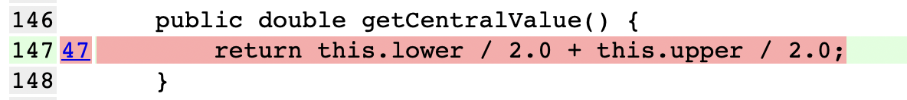

### Mutant 1 is killed by our getCentralValue() test

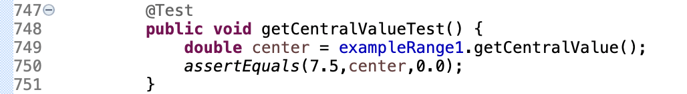

### Explanation

This mutant was killed by our unit test getCentralValue() seen above. This mutant changes the value of the 2.0 which divides the lower bound to 1.0. With this happening our test will now fail and thus kill the mutant as reported. Our test fails with this mutant as the value returned by exampleRange1.getCentralValue() will no longer be as expected 7.5. Instead since the exampleRange1 has range (5.0,10.0) the new calculation returned is (5.0/1.0) + (10.0/2.0) = 10.0. This does not match the previous expected value of 7.5 and is why the mutant is killed in this scenario.

## MUTANT #2.)

### Mutant 2 effects the intersects(Range range) method

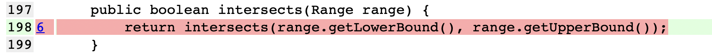

### Mutant 2 is killed by our getIntersectsTestUpperBound() test

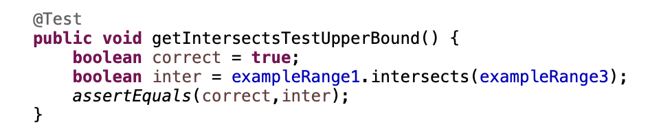

### Explanation

This mutant was killed by our unit test getIntersectsTestUpperBound() seen above. This mutant changes the return boolean to a fixed value of false. With this happening our test will now fail and thus kill the mutant as reported. Our test fails with this mutant as the value returned by exampleRange1.getCentralValue() will no longer be as expected true but rather false. Since the exampleRange1 has range (5.0,10.0) and the exampleRange3 has range (8.0,15.0) we expect a true result for overall in this test. The fixed false result does not match the previous expected result of true and is why the mutant is killed in this scenario.

## MUTANT #3.)

### Mutant 3 effects the contains() method

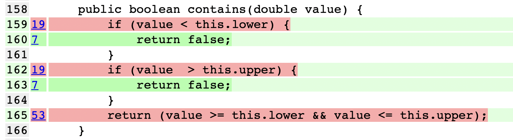

### Mutant 3 should be killed by our containsValueInRange() test

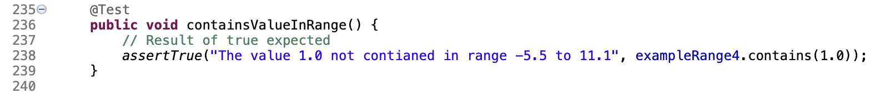

### Explanation

This mutant survived our unit test case as seen above. This particular mutant changes the value of the local variable given as 1 to be a -1. This mutant is not caught for our test because the example range we are using is (-5.5,11.1). Therefore both 1 and -1 are inside the range. So despite adding the mutant the test case will still pass as -5.5 is less than -1.0 and 11.1 is larger than -1.0. If we wanted this test case to kill this particular mutant, we would need to choose an example range with a lower bound greater than -1.0 so the mutant would not fall within the range. This would cause the test case to fail and the mutant would be killed.

## MUTANT #4.)

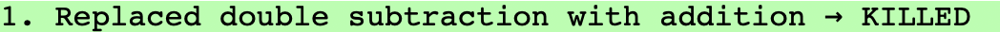

### Mutant 4 effects the getLength() method

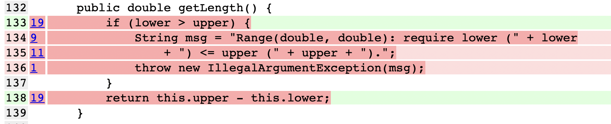

### Mutant 4 is killed by our getLengthPositiveRange() test

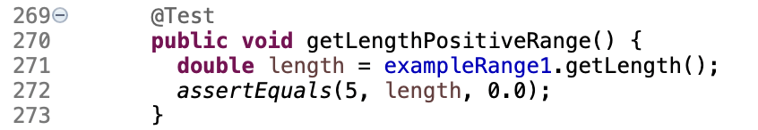

### Explanation

This mutant was killed by our unit test getLengthPositiveRange() seen above. This mutant changes the sign of the return value statement from a negative to a positive. With this happening our test will now fail and thus kill the mutant as reported. Our test fails with this mutant as the value returned by exampleRange1.getLength() will no longer be as expected 5.0. Instead since the exampleRange1 has range (5.0,10.0) the new calculation returned is 5.0 + 10.0 = 15.0. This does not match the previous expected value of 5.0 and is why the mutant is killed in this scenario.

## MUTANT #5.)

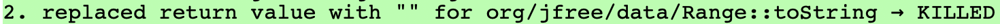

### Mutant 4 effects the toString() method

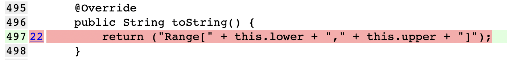

### Mutant 4 is killed by our testToString() test

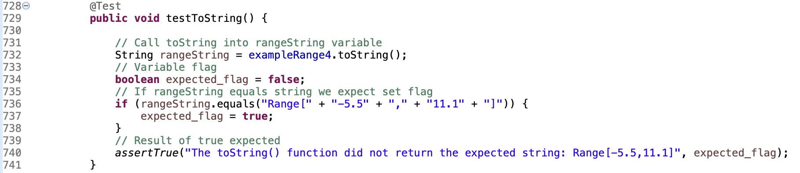

### Explanation

This mutant was killed by our unit test testToString() seen above. This mutant changes the expected return string created by the method to an empty string "". With this happening our test will now fail and thus kill the mutant as reported. Our test fails with this mutant as the string returned by exampleRange4.toString() will no longer be "Range[-5.5,11.1]" as expected. Instead since the returned string is just "" which does not match the previous expected string and is why the mutant is killed in this scenario.

# Report all the statistics and the mutation score for each test class

### Range Class Mutation Coverage Before = 54%

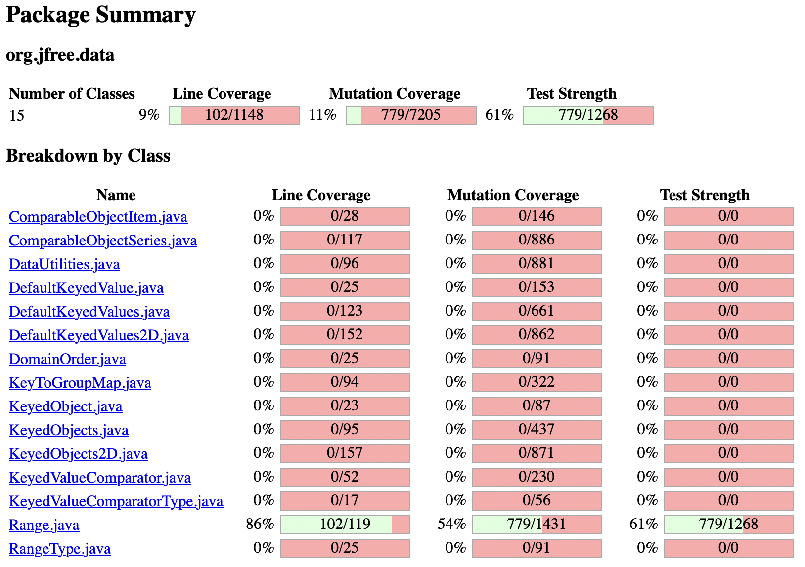

### DataUtilities Class Mutation Coverage Before = 11%

Note: These previous test suites from assignment 3 may have contained tests which failed or had errors. These had to be removed in order to run the mutation test.

### Range Class Mutation Coverage After = 64% (Goal increase 10%)

### DataUtilities Class Mutation Coverage After = 35% (Goal increase 10%)

# Analysis drawn on the effectiveness of each of the test classes

### RangeTest (Analysis and Design Strategy)

Reviewing the effectiveness of our mutation coverage on the range test class we created we noticed a few key factors. The first is that our original mutation coverage was only 54%. We found this somewhat suprising as we had previously found high coverages for this class in assignment 3. After reviewing the summary log, it was dizcovered that some areas of the code we were not being tested as closely as we had anticapated. We found that from the log there were areas where many mutants were surviving. Many of these mutant were mutants effecting the same code lines. Our plan was to target these mutants by writing new test cases into or previous test suites to increase the mutation coverage by killing numerous mutants in a singular test. We found a few areas in the class itself where many mutants surived. These included methods intersects(), expands() and combineIgnoringNaN(). So our plan was to target these classes with new, detailed and specific test cases to increase mutation coverage over the 10% mark. In the end our new tests starting on line 879 of the code included. However it should be noted that equivalence mutants do effect mutation score accuracy negatively as we will describe in more depth below.

getIntersectsTestUpperBoundCloseMatch(), getIntersectsTestLowerBoundCloseMatch(), getIntersectsTestInside(), testCombineIgnoringNaNWithUpperNaN(), testCombineIgnoringNaNWithLowerNaN()....

### DataUtilities (Analysis and Design Strategy)

...

# A discussion on the effect of equivalent mutants on mutation score accuracy

Equivalent mutants have a very negative effect on mutation score accuracy. In this lab we have treated mutation score to be the same as mutation coverage for purposes of the limitations of PITest. This is where the mutation score is equal to the (total mutants killed / all mutants). However, in an ideal calculation for mutation score we would not want to have equivalent mutants included in the mutation score. We would want to target a mutation score calculation that is (total mutants killed / all mutants which are not equivalent). This is because the definition of a equivalence mutant is a mutant which acts in the same behaviour as the program. If this was the case than these mutants are not really program bugs at all. Rather, a equivalence mutant is just the same code we are testing written in a different way that works the same. Therefore we are not really expecting a equivalence mutant to ever be killed as it really is not a program bug at all. With these equivalence mutants included in our mutation score accuracy we can see that the will actually dilute the level of mutation score accuracy as we are expecting to kill mutants which are not actually intended to be killed as they properly reflect the intentions of what the program should be doing. Therefore equivalent mutants being added to mutation score will actually produce a mutation score that is lower than that of the true mutation score. Equivalent mutants may be detected by hand if you are to review all survived mutants in the code in detail. However the majority of time equivalence mutation detection is a undecidable problem.

# A discussion of what could have been done to improve the mutation score of the test suites

Refelecting on our experince working with PITest and mutation testing we have learned a valuable new skill. We imporved our test suites mutation coverage to an extent however we could have done even more to imporve this. Our plan to contiune imporving the mutation coverages would have been extremly similar to that of the imporvements we made in this lab. The way to maximize mutation coverage increase is to target mutants affecting the same lines. This is because killing multiple mutants with one test is much more efficent than writing a whole test to target only a singular mutant at a time. We would expect a point were it would be extremely diffuclt to catch all mutants without very specific tests. For example or RangeTest.java suite now has over 50 unit tests but still not even over 70% mutation coverage. We would need to contiune to create even more specialized tests by directly reviewing the summary log to catch even more mutants and improve the mutation score of our test suites.

# Why do we need mutation testing? Advantages and disadvantages of mutation testing

We need mutation testing to ensure our tests are effective in catching the variety of bugs that may be present within the system. Mutation testing allows for the altering of source code to catch mutants that survive and actually verify our test cases effectiveness. Advantages of mutation testing is that it tests our test cases through the changing of source code. The validation of testing the very tests that test our system has great value for the integrity of the system. Mutation testing has high levels of error detection as well as it tests many different variations of the source code. Some disadvantages of mutation testing is that it sometimes creates a mutant that survives that can’t be solved in some cases by the test code as it would go against the logic of the source code which can cause confusion. The large amount of mutations used in mutation testing is very confusing in how many mutants are created at once.

# Explain your SELENUIM test case design process

When creating out SELENUIM tests we wanted to design test cases with scenerios that would verifiy some of the major functionalities on the site we picked. Since we chose to work with the AMAZON page, we began playing with the page to see what sort of capabilities and functionalities it had. A few major things we noticed were the sign/register, search, filiter and purchase iteams abilities. We wanted to create tests that will try to encapsulate the major uses of these functionalities. In our design process we decided to each look into two of our own areas on the site to create tests for them. From there we found it would be best to give each group member their own oppurtuinity to play with the new SELENIUM GUI testing tool. Each group member was to create two specific tests that would display the ability of their two site capabilites. Each of the test cases we have provided are titled with the names of each group member and the web page functionality their test was to verifiy. 

# Explain the use of assertions and checkpoints

### Kolby's tests 1 and 2

For my tests I used a combination of assertion statements and verification checkpoints to track if the value where being recorded as intended. For test #1 I included this for the search bar text feild to verify "Basketball" was searched. I also included assert statements to verify that the values for the price range text box of low and high were 5 and 40 as expected. For the login test #2 I verified a login test with a valid user. I included assertions for the email and password text box as well as varify checkpoints to be sure they were valid as intended.

### Sadman's tests ? and ?

### Nolan's tests ? and ?

### Siddharth's tests ? and ?

# how did you test each functionaity with different test data

### Kolby's tests 1 and 2

For my test #1 I did not test the search with different data as it would be impossible to test for all possible search options. This is why I decided to only test for a singular iteam "Basketball". In the filter bar I tested more than one brand search option by selecting both splading and wilson brand. For the price search bar I tried only one valid price range as trying to cover all valid price ranges would be unreasonable. In my test #2 login I didn't test for different data sets as I didn't think it would be effective to make numerous Amazon account. This is why only one account was created for testing purposes of the valid user login functionality.

### Sadman's tests ? and ?

### Nolan's tests ? and ?

### Siddharth's tests ? and ?

# Discuss advantages and disadvantages of Selenium vs. Sikulix

The pros of Sikulix compared to Selenium is that Sikulix makes use of an RPA tool that uses images on the screen for testing automation which can be better in some cases such as image captcha. The cons of Sikulix compared to Selenium is that Sikulix requires an image storage to be used for image recognition within the web page. Sikulix is also not great for the reading of text as compared to Selenium HTML based operation. Sikulix is less applicable to testing in most cases as it uses RPA and Selenium uses HTML/XML. We found selenium to be very straightforward to use and had a easy time creating test cases. Selenium supports almost all modern broswers as well. Sikulix sometimes didnt open until we cleared the registry.

# How the team work/effort was divided and managed

For this assignment we followed a similar format to that of the previous two assignments. We again thought it would be most effective for the mutation testing portion of this assignment to use peer program. So, we had Kolby and Siddharth once again working on the range class while Sadman and Nolan worked on the DataUtilities class. As a group we worked through other areas of the mutation testing portion of this assignment. All members were given a role to contribute on in the report. After completion all group members were to review eachothers work to provide feedback and fix any discrepancies. The second portion of this assignment was a little more straightforward to delegate tasks. Each group member was to review the page a find two functionalities in which they would create test cases for. As a group we recorded our results in the report for the design process, how we individual handled building our test cases and what we discovered between Selenium and Sikulix tools. Overall each member was given roughly similar workload so that the group could successfully complete this assignment.

# Difficulties encountered, challenges overcome, and lessons learned

We found this lab to be pretty similar to that of the other labs. We learned valuable lessons in both mutation testing and GUI testing. We discovered how mutation tests work and why they can be important. We also found out how equivalence mutants can hurt mutation score accuracy. For the GUI testing portion we learned two new tool in testing with Selenium vs. Sikulix and were able to see pros and cons of each. Looking at some of the challenges this lab gave us we found a few trends. Firstly, we encountered some diffuclties with learning the new PITest, Selenium and Sikulix softwares. We had to use our teammates to troubleshoot these set up issues. Another diffucltiy we found was trying to keep the project on track. We had a busy schedule during this assignments time period and need to have strong communication in order to make sure all members could finish the assignment.

# Comments/feedback on the lab itself

A few comments on the lab we have are that we found it to be pretty interesting and new. None of us had ever used these new technologies for testing before. However, as a group wwe felt it may have been more exciting to work with new classes rather than the same range and datautilies classes from assignment 2 and 3. Providing a few more detials on setting up new softwares used for this assignment in the form of short videos could have been useful. Overall we as a group enjoyed this lab. 
