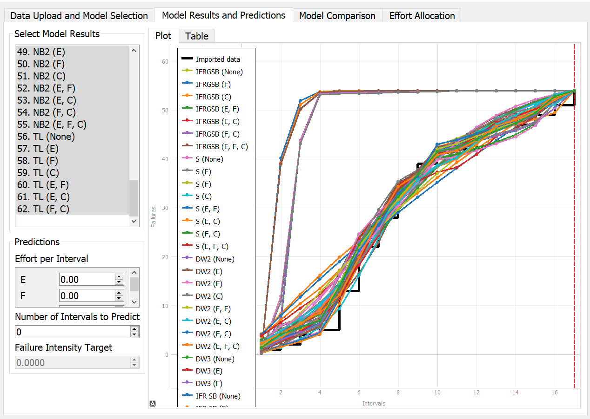
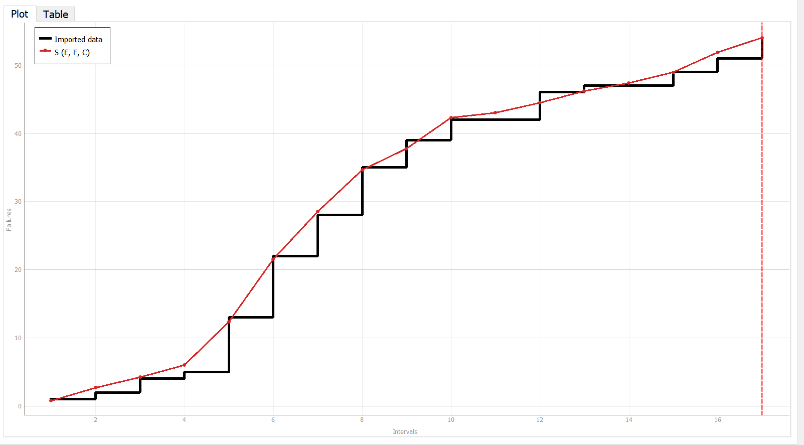
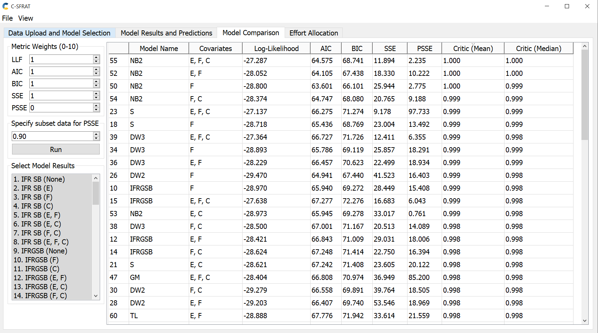
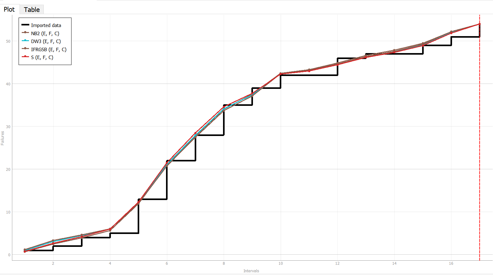
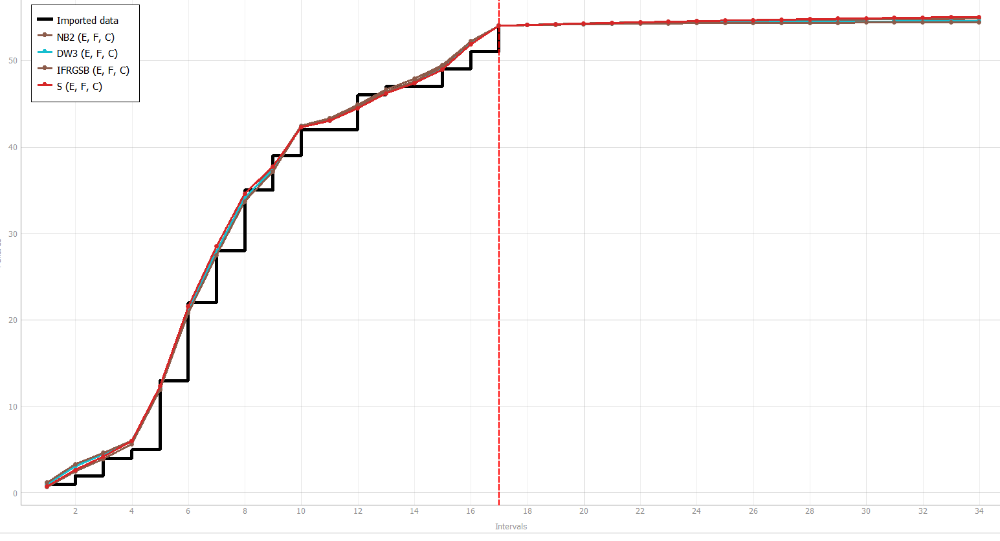
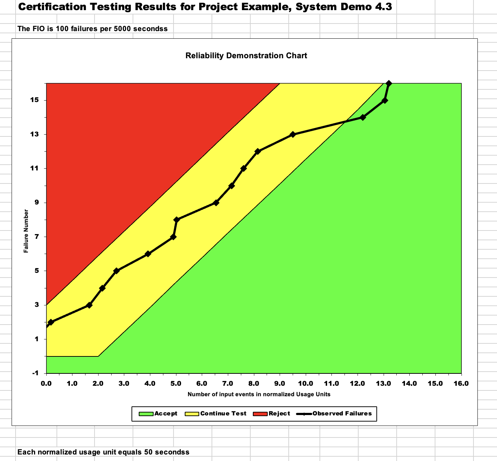
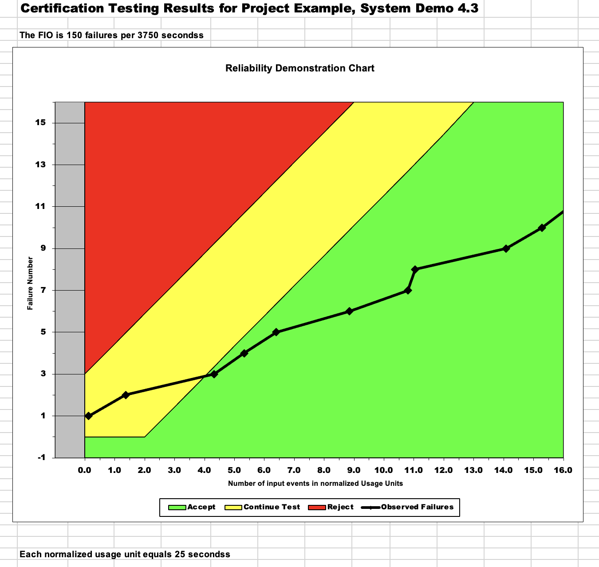
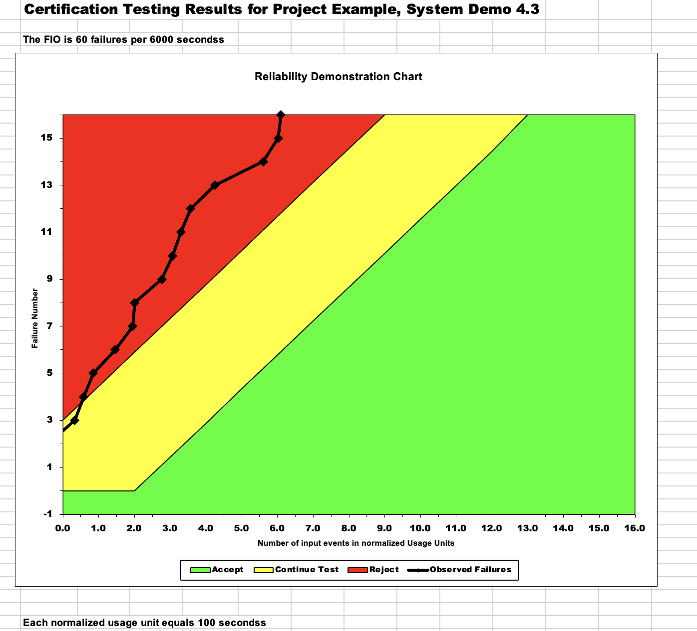

**SENG 438- Software Testing, Reliability, and Quality**

**Lab. Report \#5 – Software Reliability Assessment**

| Group: Group Number 17     |
|-----------------|
| Student 1 Kolby Lalonde                |   
| Student 2 Sadman Shahriar              |   
| Student 3 Nolan Parmar              |   
| Student 4 Siddharth Menon           |   

# Introduction

In this lab we will learn how to use reliability assessment tools to review integration test data. The two ways we will look into are 

  1. Reliability growth testing
  2. Reliability assessment using Reliability Demonstration Chart (RDC)

Both of which will be studied in this project.

# 

# Assessment Using Reliability Growth Testing 

Using the C-SFRAT tool, we analyzed all the available models on the failure data provided. After looking at Model Results and Predictions, the group analyzed the results to determine the model which provided the best fit. All Models' Results are overlayed in the following image:

### Selected Models Comparison

Using the tool C-SFRAT allowed us to compare the various models with the Model Comparison feature where we could view how each model fits with the failure data. We could decide upon the best model by checking which line is the closest to the failure data input we provide. Also, the chart displays the correspondence between failure data and the best model that uses the S sequence to closely track the data. From this, it shows the S sequence models closely model the failure data when it is calculated with respect to the three parameters.

Upon looking at the overall shape of the Results, the group determined that the best two models, and the ones that were chosen as a result, were NB2. Furthermore, upon looking at the Model Comparison tab, the Critic (mean) for the NB2 model is 1.000 which essentially presents an idea fit for the input data, and the Critic (mean) for the second S model is 0.999, which is close to ideal and the log likelihood is the closest model to positive infinity. The Model Comparison table is provided below for reference:

### Result of range analysis (an explanation of which part of data is good for proceeding with the analysis)

n the C-SFRAT tool, there was no option to conduct a range analysis such as Laplace. Furthermore, the CASRE tool did not work on any group member's laptop after several attempts even after data manipulation and changing the data to fit the format of the sample inputs provided. As such, the group set the Subset Failure Data Range to 17 intervals. This was done by looking at the graph and determining that the data before 18 intervals showed a steady increase whereas afterwards, it became much steeper increases. As such, the first steady rise subset was selected as the Range. The chosen models' Results are displayed below: 

As can be seen, this graph shows the Results being very close together.

To observe the expected behaviour, and whether or not the number of failures is expected to plateau (steady out) using the two models and the specified Range, the predicted value for the number of intervals was set to 20. This number was determined through trial and error, and the result produced is as follows:

### Plots for failure rate and reliability of the SUT for the test data provided

(nolan or sid)

### Decision making given a target failure rate

(nolan or sid)

### Advantages and Disadvantages of Reliability Growth Analysis

The advantages of Reliability Growth Analysis include:

- Reliability Growth Analysis is a statistical method to estimate time and costs associated with product development and the reliability goal. The reliability goal can be in the form of a Mean Time Between Failure, Annualized Failure rate, or any number of different metrics.
- Reliability Growth Analysis helps to regulate a management strategy to reach the reliability goal.
- It can be applied from early development stages until the end of life of a product. There are also various different models that are available to be utilized with Reliability Growth Analysis.
- Reliability growth analysis is conducted in a dynamic environment where the reliability can change due to corrective actions.
- 
The disadvantages of Reliability Growth Analysis include:

- Reliability growth models may not be able to be applied to software with a lack of software failure data.
- Reliability growth models selected may have a bias or not be the best fit for a project's data, as it is determined by human choice.

# Assessment Using Reliability Demonstration Chart 

### 3 Plots for MTTFmin, Double MTTFmin and Half MTTFmin

### MTTFmin

### Double MTTFmin

### Half MTTFmin

### Explanation of the decided MTTFmin value

After the intial setting up of test data was input into our RDC we had to modifiy to a couple parameters inorder to obtain a useful RDC. First we explored how changing the maximum number of acceptable failures variable would affect our chart. It was discovered that increasing this variable would push our data to the left and cause for likely rejection. The other variable we changed was the number of input events. We found that the larger this was the more the data points would move to the right into the acceptable region. Our method for finding a useful MTTFmin was to get a ratio which would keep our data in the middle yellow region for the majority of the intervals. This is because it would provide a more accurate review of the reliability of the system. 

We ultimately spent a fair amount of time testing this ratio by increasing the max acceptable number of failures by 10 each time and the input events by 50 each time. We discovered that when the max acceptable number of failures was 100 and the input events was 5000 we had the best results. Therefore we preformed our MTTFmin calculation as follows. 

MTTFmin = (Max Acceptable Failures / Input Events) = (100/5000) = 0.02

our calculations for the other two RDC charts seen above where as follows

DoubleMTTFmin = (Max Acceptable Failures / Input Events) = (150/3750) = 0.04

HalfMTTFmin = (Max Acceptable Failures / Input Events) = (60/6000) = 0.01

The results of these three graph show how changing a RDC MTTFmin ratio can effect the result of the reliability. As we can now see if MTTFmin is larger then it is easier for the test data to pass and cross into the acceptable region. However, reducing MTTFmin will have the opposite effect as it will be more likely that the data with cross into the rejection region. This makes sense as larger MTTFmin has greater maximum number of acceptable failures to events which are input. Therefore we are allowing the system to fail more often and still accepting its reliability. Smaller MTTFmin let there be less acceptable failures which will make it harder to pass on the RDC as we have seen above.

### Advantages and Disadvantages of RDC

The advantages of RDC include:

- Allowing the user to set a predefined or customized risk tolerance profile.
- Easy to generate graph quickly using minimal data.
- Provides a strong visual assesment of the reliability of the system under test.
- Decision making process for accepting or rejecting a system is clear and obvious.
- Trying out different values of confidence levels and the MTTF is reasonable.

The disavantages of RDC include:

- Based on inter failure times only.
- Some failure data types outside of cumlative failures can not be observed.
- Cannot be used to calculate the exact quantitative value for the reliability of our system.
- Can only indicate if system is acceptable or not with no further instruction.

# Comparison of Results

Looking at our results from part 1 and 2 of this project we have seen how to use both the growth and RDC methods on a test data set. From part 1 we have seen that the growth testing method showed different way of displaying the reliablility of the system under test than part 2. Depending of the difffuclt of the RDC we may reject or accept the system. While with the growth method we are provided a different visual to how the reilablity of the system can be assessed.

# Discussion on Similarity and Differences of the Two Techniques

Similarity:

- Both visually display the reliability of a system under test.
- Both can be based on inter failure times and target failure rate (MTTF).
- Both provide useful feedback to the extent to which a system is reliable.

Differences:
- RDC: provides a clear result of which the system is accepted or rejected.
- RDC: Different confident levels can be created to change diffuclty of the test.
- Reliability growth analysis: Can be based on failure count.
- Reliability growth analysis: Various different models are available to be utilized.

# How the team work/effort was divided and managed

In order to complete this lab we divided the work accross the two parts. We had Sid and Nolan focus on the first part of the project reliability growth testing. We had Kolby and Sadman focus on the second part of the assignment RDC. With that being said, all group members took the time to test both parts on their own and understand how all portionas of the assignment were implemented. The work for the report was also generally split accross these pairs as well. All group members contributed to the completion of this assignment. Unfortunatly due to unforseen circumstances group member Sadman was unable to preform the demo portion of this assignment.

# Difficulties encountered, challenges overcome, and lessons learned

In this assignment the group experinced a few diffuclties. These mainly came from getting the softwares to run properly with our test data. So becuase of this we had to really work together to figure out who would be able to complete what portion of the assignment. We found that it is important to problem solve these issues in a timely manner as we found our group felt a little rushed to complete the assignment before the demo. In future assignments the group will be more aware of time management as well as seeking help on technology issues sooner rather than later.

# Comments/feedback on the lab itself

The group found this lab to be slighty less informative than some of the previous assignments. This may have been due to the issues with the software mentioned before. It maybe more effective to provide a clear test data format for which the software will run within the lab assignment itself. We also noticed that there were few resources to help with troubleshooting these issues. Perhaps a more detailed lab document would provide students more guidance with this particular assignment. However, the group found the topic of reliability to be fairly interesting and important to creating successful software projects.
