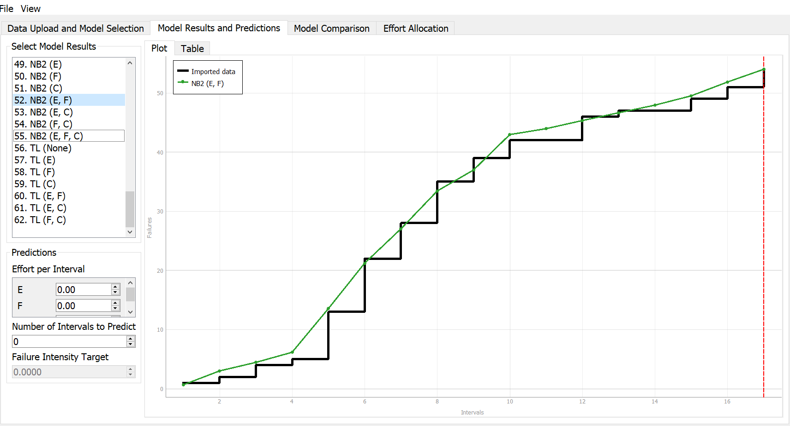

**SENG 438- Software Testing, Reliability, and Quality**

**Lab. Report \#5 – Software Reliability Assessment**

| Group: Group Number 17     |
|-----------------|
| Student 1 Kolby Lalonde                |   
| Student 2 Sadman Shahriar              |   
| Student 3 Nolan Parmar              |   
| Student 4 Siddharth Menon           |   

# Introduction

In this lab we will learn how to use reliability assessment tools to review integration test data. The two ways we will look into are 

  1. Reliability growth testing
  2. Reliability assessment using Reliability Demonstration Chart (RDC)

Both of which will be studied in this project.

# 

# Assessment Using Reliability Growth Testing 

Using the C-SFRAT tool, we analyzed all the available models on the failure data provided. After looking at Model Results and Predictions, the group analyzed the results to determine the model which provided the best fit. All Models' Results are overlayed in the following image:

### Selected Models Comparison

Using the tool C-SFRAT allowed us to compare the various models with the Model Comparison feature where we could view how each model fits with the failure data. We could decide upon the best model by checking which line is the closest to the failure data input we provide. Also, the chart displays the correspondence between failure data and the best model that uses the NB2 sequence to closely track the data. From this, it shows the NB2 sequence models closely model the failure data when it is calculated with respect to the three parameters.

Upon looking at the overall shape of the Results, the group determined that the best two models, and the ones that were chosen as a result, were NB2. Furthermore, upon looking at the Model Comparison tab, the Critic (mean) for the NB2 model is 1.000 which essentially presents an idea fit for the input data, and the Critic (mean) for the second NB2 model is 1.00, which is close to ideal. The Model Comparison table is provided below for reference:

### Result of range analysis (an explanation of which part of data is good for proceeding with the analysis)

(nolan or sid)

### Plots for failure rate and reliability of the SUT for the test data provided

(nolan or sid)

### Decision making given a target failure rate

(nolan or sid)

### Advantages and Disadvantages of Reliability Growth Analysis

(nolan or sid)

# Assessment Using Reliability Demonstration Chart 

### 3 Plots for MTTFmin, Double MTTFmin and Half MTTFmin

### MTTFmin

### Double MTTFmin

### Half MTTFmin

### Explanation of the decided MTTFmin value

After the intial setting up of test data was input into our RDC we had to modifiy to a couple parameters inorder to obtain a useful RDC. First we explored how changing the maximum number of acceptable failures variable would affect our chart. It was discovered that increasing this variable would push our data to the left and cause for likely rejection. The other variable we changed was the number of input events. We found that the larger this was the more the data points would move to the right into the acceptable region. Our method for finding a useful MTTFmin was to get a ratio which would keep our data in the middle yellow region for the majority of the intervals. This is because it would provide a more accurate review of the reliability of the system. 

We ultimately spent a fair amount of time testing this ratio by increasing the max acceptable number of failures by 10 each time and the input events by 50 each time. We discovered that when the max acceptable number of failures was 100 and the input events was 5000 we had the best results. Therefore we preformed our MTTFmin calculation as follows. 

MTTFmin = (Max Acceptable Failures / Input Events) = (100/5000) = 0.02

our calculations for the other two RDC charts seen above where as follows

DoubleMTTFmin = (Max Acceptable Failures / Input Events) = (150/3750) = 0.04

HalfMTTFmin = (Max Acceptable Failures / Input Events) = (60/6000) = 0.01

The results of these three graph show how changing a RDC MTTFmin ratio can effect the result of the reliability. As we can now see if MTTFmin is larger then it is easier for the test data to pass and cross into the acceptable region. However, reducing MTTFmin will have the opposite effect as it will be more likely that the data with cross into the rejection region. This makes sense as larger MTTFmin has greater maximum number of acceptable failures to events which are input. Therefore we are allowing the system to fail more often and still accepting its reliability. Smaller MTTFmin let there be less acceptable failures which will make it harder to pass on the RDC as we have seen above.

### Advantages and Disadvantages of RDC

(sadman)

# Comparison of Results

(sadman)

# Discussion on Similarity and Differences of the Two Techniques

(sadman)

# How the team work/effort was divided and managed

(kolby)

# Difficulties encountered, challenges overcome, and lessons learned

(kolby)

# Comments/feedback on the lab itself

(kolby)
